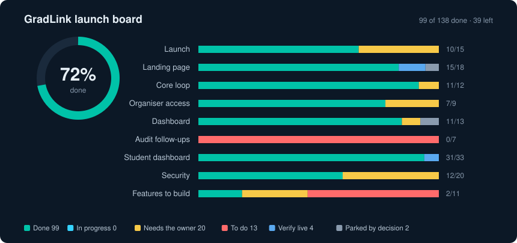
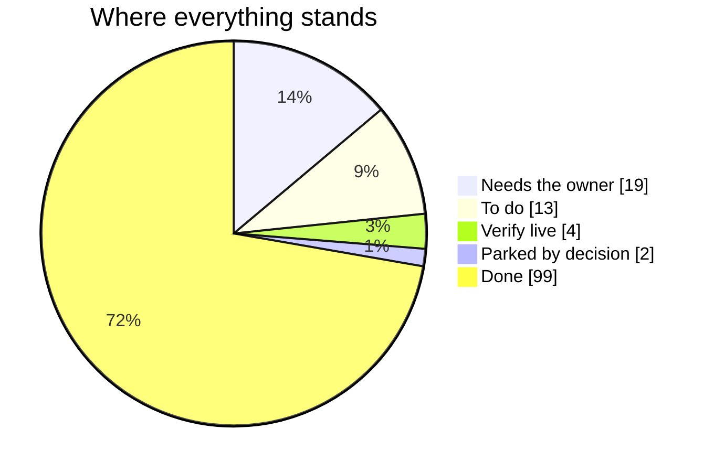

# GradLink Launch Board

> Generated from [`docs/checklists/`](../docs/checklists/) by [`generate.mjs`](generate.mjs). Do not edit this file by hand: tick the item in its checklist and the board rebuilds itself. See [How it updates](#how-it-updates).

**99 of 137 done (72%).** 0 in progress, 38 left. Checklists last changed 2026-10-06.

Open the interactive version: download [`index.html`](index.html) and open it in a browser.

## By area

| Area | Progress | Done | Left | Checklist |
|---|---|---|---|---|
| Launch | `█████████░░░` 71% | 10 | 4 | [launch.md](../docs/checklists/launch.md) |
| Landing page | `██████████░░` 83% | 15 | 3 | [landing-page.md](../docs/checklists/landing-page.md) |
| Core loop | `███████████░` 92% | 11 | 1 | [core-loop.md](../docs/checklists/core-loop.md) |
| Organiser access | `█████████░░░` 78% | 7 | 2 | [organiser-access.md](../docs/checklists/organiser-access.md) |
| Dashboard | `██████████░░` 85% | 11 | 2 | [dashboard.md](../docs/checklists/dashboard.md) |
| Audit follow-ups | `░░░░░░░░░░░░` 0% | 0 | 7 | [audit-follow-ups.md](../docs/checklists/audit-follow-ups.md) |
| Student dashboard | `███████████░` 94% | 31 | 2 | [student-dashboard.md](../docs/checklists/student-dashboard.md) |
| Security | `███████░░░░░` 60% | 12 | 8 | [security.md](../docs/checklists/security.md) |
| Features to build | `██░░░░░░░░░░` 18% | 2 | 9 | [features-to-build.md](../docs/checklists/features-to-build.md) |
| **All** | `█████████░░░` **72%** | **99** | **38** | |

## In progress

Nothing is in progress right now. Open a pull request that ticks an item, or put `board: <id>` in its description, and it shows here.

## Left to do

### Needs the owner (19)

- [ ] **Cloudflare GitHub builds fail on every commit** · Launch · [source](https://github.com/divitkej/gradlink/blob/main/docs/checklists/launch.md?plain=1#L21) The Worker is connected to this repo in Cloudflare (Workers Builds) and every build since PR #5 opened has failed; the live site is unaffected because it was deployed with `npm… · id `launch/cloudflare-github-builds-fail-on-every`
- [ ] **Old Vercel site still live** · Launch · [source](https://github.com/divitkej/gradlink/blob/main/docs/checklists/launch.md?plain=1#L23) `https://gradlink-theta.vercel.app` returns 200. Delete the project in the Vercel dashboard (no repo access to it). Owner action · id `launch/old-vercel-site-still-live`
- [ ] **Custom domain** · Launch · [source](https://github.com/divitkej/gradlink/blob/main/docs/checklists/launch.md?plain=1#L28) Add the domain to Cloudflare, then attach it to the `gradlink` Worker, set `APP_URL` in `wrangler.jsonc` and change the `SITE_URL` fallback in `lib/site.ts` to it. Owner action,… · id `launch/custom-domain`
- [ ] **Account email: confirm email and password reset** · Launch · [source](https://github.com/divitkej/gradlink/blob/main/docs/checklists/launch.md?plain=1#L30) Built and tested (`lib/server/smtp.ts`, `lib/server/mail.ts`, `/verify-email`): sign-up emails a confirm link and sign-in waits for it, and "Forgot password" emails a reset link.… · id `launch/account-email-confirm-email-and-password`
- [ ] **Live rules match the repo** · Core loop · [source](https://github.com/divitkej/gradlink/blob/main/docs/checklists/core-loop.md?plain=1#L43) Replaced: the app does not read Firestore any more, so there are no live rules to deploy. What is left is closing the old Firebase project so its data is not still readable under… · id `core-loop/live-rules-match-the-repo`
- [ ] **Run the migration before deploying this code** · Organiser access · [source](https://github.com/divitkej/gradlink/blob/main/docs/checklists/organiser-access.md?plain=1#L28) `npm run db:migrate` creates `event_codes`, gives every existing event its codes, adds the plan columns and creates `app_errors`. The new code needs these tables; it is safe to… · id `organiser-access/run-the-migration-before-deploying-this`
- [ ] **Set `ADMIN_EMAILS`, then sign up with that email straight away** · Organiser access · [source](https://github.com/divitkej/gradlink/blob/main/docs/checklists/organiser-access.md?plain=1#L29) `npx wrangler secret put ADMIN_EMAILS` with your email. Sign-up now only accepts campus and company domains, and emails in `ADMIN_EMAILS` skip that rule, so a personal address… · id `organiser-access/set-admin-emails-then-sign-up`
- [ ] **Several Claude sessions deploy to the same Worker** · Dashboard · [source](https://github.com/divitkej/gradlink/blob/main/docs/checklists/dashboard.md?plain=1#L43) Each `npm run deploy` replaces the whole live site with that session's branch, so work from other branches disappears from the live site until merged. Deploy only from `main`… · id `dashboard/several-claude-sessions-deploy-to-the`
- [ ] **Set `APP_URL`** · Security · [source](https://github.com/divitkej/gradlink/blob/main/docs/checklists/security.md?plain=1#L34) in `wrangler.jsonc` to the custom domain. Reset emails, upload links and Stripe return URLs use it. · id `security/set-app-url`
- [ ] **Run `npm run db:migrate`** · Security · [source](https://github.com/divitkej/gradlink/blob/main/docs/checklists/security.md?plain=1#L35) against production Neon to create the `rate_limits` table. Until it exists the per-IP limits are skipped and the Worker logs a warning. · id `security/run-npm-run-db-migrate`
- [ ] **Optional, after the custom domain is connected** · Security · [source](https://github.com/divitkej/gradlink/blob/main/docs/checklists/security.md?plain=1#L36) add a Cloudflare WAF rate limiting rule on `/api/auth/*` as a second layer. WAF rules attach to your own domain, so they cannot cover the workers.dev address. · id `security/optional-after-the-custom-domain-is`
- [ ] **Least-privilege database role** · Security · [source](https://github.com/divitkej/gradlink/blob/main/docs/checklists/security.md?plain=1#L37) In Neon, create a role with only select, insert, update, delete on the app tables and use it for `DATABASE_URL`, instead of the owner role. Keep the owner role for `npm run… · id `security/least-privilege-database-role`
- [ ] **Backups** · Security · [source](https://github.com/divitkej/gradlink/blob/main/docs/checklists/security.md?plain=1#L38) Confirm Neon's restore window covers at least 7 days. · id `security/backups`
- [ ] **Secrets** · Security · [source](https://github.com/divitkej/gradlink/blob/main/docs/checklists/security.md?plain=1#L39) Confirm `AUTH_SECRET` is 32+ random characters and differs between local and production. Use Stripe live keys only in production. · id `security/secrets`
- [ ] **Account verification** · Security · [source](https://github.com/divitkej/gradlink/blob/main/docs/checklists/security.md?plain=1#L40) Sign-up now refuses personal, throwaway and test addresses for every role; a college gives an example of its students' email at sign-up, and students can only sign up on that… · id `security/account-verification`
- [ ] **Verify live** · Security · [source](https://github.com/divitkej/gradlink/blob/main/docs/checklists/security.md?plain=1#L41) after deploy, check the headers with https://securityheaders.com and test the QR scanner camera on a phone. · id `security/verify-live`
- [ ] **Confirm the claim "Setup in 48 hours"** · Features to build · [source](https://github.com/divitkej/gradlink/blob/main/docs/checklists/features-to-build.md?plain=1#L73) Where: CTA section · id `features-to-build/setup-in-48-hours`
- [ ] **Confirm the claim "No contract lock-in"** · Features to build · [source](https://github.com/divitkej/gradlink/blob/main/docs/checklists/features-to-build.md?plain=1#L74) Where: CTA section · id `features-to-build/no-contract-lock-in`
- [ ] **Confirm the claim "Dedicated onboarding"** · Features to build · [source](https://github.com/divitkej/gradlink/blob/main/docs/checklists/features-to-build.md?plain=1#L75) Where: CTA section · id `features-to-build/dedicated-onboarding`

### To do (13)

- [ ] **"Start free" does nothing** · Audit follow-ups · [source](https://github.com/divitkej/gradlink/blob/main/docs/checklists/audit-follow-ups.md?plain=1#L19) `onCta` returns straight away for the free plan, so the Starter button on `/pricing` has no effect. Send it to `/sign-up`. `components/PricingSection.tsx` · Dead button · id `audit-follow-ups/start-free-does-nothing`
- [ ] **No message after Stripe checkout** · Audit follow-ups · [source](https://github.com/divitkej/gradlink/blob/main/docs/checklists/audit-follow-ups.md?plain=1#L21) Checkout returns to `/dashboard/event-manager?upgraded=1` or `/pricing?canceled=1`, but neither page reads the parameter, so the college gets no confirmation either way.… · id `audit-follow-ups/no-message-after-stripe-checkout`
- [ ] **College sidebar has no Messages or Profile link** · Audit follow-ups · [source](https://github.com/divitkej/gradlink/blob/main/docs/checklists/audit-follow-ups.md?plain=1#L26) Students and companies get both. Colleges can only reach Messages through the header bell. `components/dashboard/DashboardShell.tsx` · Partial · id `audit-follow-ups/college-sidebar-has-no-messages-or`
- [ ] **Scan history is not linked anywhere** · Audit follow-ups · [source](https://github.com/divitkej/gradlink/blob/main/docs/checklists/audit-follow-ups.md?plain=1#L28) `/dashboard/scans` exists but no sidebar or page links to it, so it is only reachable by typing the address. `components/dashboard/DashboardShell.tsx`,… · id `audit-follow-ups/scan-history-is-not-linked-anywhere`
- [ ] **Signed-in people can still open the sign-in page** · Audit follow-ups · [source](https://github.com/divitkej/gradlink/blob/main/docs/checklists/audit-follow-ups.md?plain=1#L33) `/sign-in` shows the form instead of sending them to their dashboard. `app/sign-in/page.tsx`, `components/gradlink/GradLinkSignIn.tsx` · Partial · id `audit-follow-ups/signed-in-people-can-still-open-the`
- [ ] **Signing in from a scanned QR loses the profile** · Audit follow-ups · [source](https://github.com/divitkej/gradlink/blob/main/docs/checklists/audit-follow-ups.md?plain=1#L35) The sign-in gate on a scanned profile links to plain `/sign-in`, and sign-in always goes to the dashboard, so the person has to scan again. Pass the scanned address through and… · id `audit-follow-ups/signing-in-from-a-scanned-qr`
- [ ] **New messages need a page reload** · Audit follow-ups · [source](https://github.com/divitkej/gradlink/blob/main/docs/checklists/audit-follow-ups.md?plain=1#L40) The messages page loads the inbox once. The unread badge polls, but an open conversation does not show a reply until the page is reloaded. `app/dashboard/messages/page.tsx`,… · id `audit-follow-ups/new-messages-need-a-page-reload`
- [ ] **Build: Interview counts for colleges** · Features to build · [source](https://github.com/divitkej/gradlink/blob/main/docs/checklists/features-to-build.md?plain=1#L52) Where the site shows it: Analytics funnel, Hero dashboard, Product reveal, Journey step 04. Notes: Invites and bookings are built for students and companies; the college… · id `features-to-build/interview-counts-for-colleges`
- [ ] **Build: Offer tracking and placement rate** · Features to build · [source](https://github.com/divitkej/gradlink/blob/main/docs/checklists/features-to-build.md?plain=1#L53) Where the site shows it: Analytics funnel, stats panels, Hero dashboard, Product reveal, Journey step 04. Notes: Students log offers in the application tracker (private to them).… · id `features-to-build/offer-tracking-and-placement-rate`
- [ ] **Build: Event ROI score** · Features to build · [source](https://github.com/divitkej/gradlink/blob/main/docs/checklists/features-to-build.md?plain=1#L54) Where the site shows it: Analytics stats. Notes: No formula or data · id `features-to-build/event-roi-score`
- [ ] **Build: Candidate stages "Contacted" and "Offer"** · Features to build · [source](https://github.com/divitkej/gradlink/blob/main/docs/checklists/features-to-build.md?plain=1#L55) Where the site shows it: Employer CRM pipeline, Platform tab CRM mini. Notes: "Interview" now shows from invites; "Contacted" and "Offer" are not tracked for companies · id `features-to-build/candidate-stages-contacted-and-offer`
- [ ] **Build: Alumni accounts** · Features to build · [source](https://github.com/divitkej/gradlink/blob/main/docs/checklists/features-to-build.md?plain=1#L56) Where the site shows it: Why GradLink card "Useful all year round". Notes: Mentoring runs as college-published sessions and internships show on Opportunities; alumni cannot sign… · id `features-to-build/alumni-accounts`
- [ ] **Build: Year-over-year comparison** · Features to build · [source](https://github.com/divitkej/gradlink/blob/main/docs/checklists/features-to-build.md?plain=1#L57) Where the site shows it: Pricing (Placement Pro) · id `features-to-build/year-over-year-comparison`

### Verify live (4)

- [ ] **Opening hero on a low-end phone** · Landing page · [source](https://github.com/divitkej/gradlink/blob/main/docs/checklists/landing-page.md?plain=1#L58) WebGL shader background plus canvas particle text. Now pauses when scrolled past or the tab is hidden, and renders at 1x on phones (4x fewer pixels). The test machine has no GPU… · id `landing-page/opening-hero-on-a-low-end-phone`
- [ ] **Link preview card** · Landing page · [source](https://github.com/divitkej/gradlink/blob/main/docs/checklists/landing-page.md?plain=1#L60) Share image regenerated with the graduation-cap logo (`app/opengraph-image.png`, source `docs/brand/opengraph-image.tsx`, in "Replace the G logo with a graduation cap");… · id `landing-page/link-preview-card`
- [ ] **Put the branch live** · Student dashboard · [source](https://github.com/divitkej/gradlink/blob/main/docs/checklists/student-dashboard.md?plain=1#L19) Merge the PR into main, then `NEXT_PUBLIC_SITE_URL=https://gradlink.divitkej.workers.dev npm run deploy` (or promote the tested preview version `0ec7412c` with `wrangler versions… · id `student-dashboard/put-the-branch-live`
- [ ] **Two-account run on real phones** · Student dashboard · [source](https://github.com/divitkej/gradlink/blob/main/docs/checklists/student-dashboard.md?plain=1#L94) Student books a full session, organiser marks attendance, student sees the passport stop and score change. Verify live · id `student-dashboard/two-account-run-on-real-phones`

### Parked by decision (2)

- [ ] **Promises features that are not built** · Landing page · [source](https://github.com/divitkej/gradlink/blob/main/docs/checklists/landing-page.md?plain=1#L46) Kept on the page by decision. Every unbuilt feature, and where it appears, is listed in `docs/checklists/features-to-build.md`. `components/landing/*` · Tracked · id `landing-page/promises-features-that-are-not-built`
- [ ] **Pill shapes on labels and tabs** · Dashboard · [source](https://github.com/divitkej/gradlink/blob/main/docs/checklists/dashboard.md?plain=1#L41) Section badges on the landing page, role chips, the manual tabs and "Back to site" are fully rounded. Left as they are by decision for now. Tracked · id `dashboard/pill-shapes-on-labels-and-tabs`

## Done

<b>Launch</b>: 10 done

- [x] Neon tables created
- [x] Worker points at the real KV namespace Done in "Point the UPLOADS binding at the real KV namespace"
- [x] Worker secrets set
- [x] Deployed and tested live
- [x] Vercel removed from the repo Done in "Remove leftover Vercel starter files and ignore entry"
- [x] Privacy Policy page Done in "Add Privacy Policy and Terms pages"
- [x] Terms and Conditions page Done in "Add Privacy Policy and Terms pages"
- [x] "UAE data residency" claim removed Done in "Add Privacy Policy and Terms pages"
- [x] Unregistered company name removed Done in "Drop the unregistered company name from the footer"
- [x] Favicon Done in "Replace the G logo with a graduation cap"

<b>Landing page</b>: 15 done

- [x] Navbar logo and section links fail on /pricing Done in "Fix landing links, sample-data labels and SEO basics"
- [x] Colleges and Analytics go to the same section Done in "Fix landing links, sample-data labels and SEO basics"
- [x] Social links go nowhere Done in "Fix landing links, sample-data labels and SEO basics"
- [x] 20 footer column links go nowhere Done in "Fix landing links, sample-data labels and SEO basics"
- [x] Invented results in the outcome funnel Done in "Fix landing links, sample-data labels and SEO basics"
- [x] Real brand names used as customers Done in "Fix landing links, sample-data labels and SEO basics"
- [x] Mockups show unlabelled sample data Done in "Fix landing links, sample-data labels and SEO basics"
- [x] Employer CRM mockup buttons do nothing Done in "Stop the Employer CRM mockup looking clickable"
- [x] Add robots.txt and sitemap Done in "Fix landing links, sample-data labels and SEO basics"
- [x] Smooth scroll lands anchor links correctly Done in "Fix landing links, sample-data labels and SEO basics"
- [x] Scroll progress bar and thread
- [x] Navbar links on the home page Done in "Fix landing links, sample-data labels and SEO basics"
- [x] Mobile menu at 375px Done in "Fix landing links, sample-data labels and SEO basics"
- [x] Hero and CTA buttons Done in "Fix landing links, sample-data labels and SEO basics"
- [x] Employer CRM mockup promised scores to employers Done in "Keep student assessments away from employers"

<b>Core loop</b>: 11 done

- [x] Users can promote themselves to event manager Done in "Fix Phase 1 core loop: event nav, checklist seeding, event editing"
- [x] Manager writes are not scoped to their own event Done in "Fix Phase 1 core loop: event nav, checklist seeding, event editing"
- [x] Any manager can edit any checklist Done in "Fix Phase 1 core loop: event nav, checklist seeding, event editing"
- [x] No way back to the event list Done in "Fix Phase 1 core loop: event nav, checklist seeding, event editing"
- [x] New events get no checklist items Done in "Fix Phase 1 core loop: event nav, checklist seeding, event editing"
- [x] Readiness is always 0% Done in "Fix Phase 1 core loop: event nav, checklist seeding, event editing"
- [x] Checklist is empty on new events Done in "Fix Phase 1 core loop: event nav, checklist seeding, event editing"
- [x] No way to edit an event Done in "Fix Phase 1 core loop: event nav, checklist seeding, event editing"
- [x] Joined events may never appear Done in "Fix Phase 1 core loop: event nav, checklist seeding, event editing"
- [x] Anyone signed in could read any event's people Done in "Scope event data to members and compute analytics live"
- [x] Student analytics never change Done in "Scope event data to members and compute analytics live"

<b>Organiser access</b>: 7 done

- [x] Separate codes for students and employers Done in "Add separate student and employer codes, plan choice and owner dashboard"
- [x] Organiser can replace a code Done in "Add separate student and employer codes, plan choice and owner dashboard"
- [x] Students and employers need a code before using the dashboard Done in "Add separate student and employer codes, plan choice and owner dashboard"
- [x] Organiser sees who joined Done in "Add separate student and employer codes, plan choice and owner dashboard"
- [x] Colleges choose a plan after signing in Done in "Add separate student and employer codes, plan choice and owner dashboard"
- [x] Owner dashboard at `/admin` Done in "Add separate student and employer codes, plan choice and owner dashboard"
- [x] Starter promised one live event but nothing enforced it Done in "Say Starter includes unlimited events"

<b>Dashboard</b>: 11 done

- [x] New events had no checklist Done in "Fix the problems found in the site audit"
- [x] Join code could not be found after creating an event Done in "Fix the problems found in the site audit"
- [x] Opening a student without an active event caused a server error Done in "Fix the problems found in the site audit"
- [x] Student profile page scrolled sideways on phones (46px) Done in "Fix the problems found in the site audit"
- [x] Dashboard search box did nothing Done in "Fix the problems found in the site audit"
- [x] "AI résumé score" claims Done in "Fix the problems found in the site audit"
- [x] College header said "Live Monitor" with a pulsing dot for events that had not started Done in "Fix the problems found in the site audit"
- [x] "Everyone is engaged 🎉" with zero students Done in "Fix the problems found in the site audit"
- [x] "Upgrade to Placement Pro" showed a developer message Done in "Fix the problems found in the site audit"
- [x] Em dashes in visible copy Done in "Fix the problems found in the site audit"
- [x] Unbranded 404 page Done in "Fix the problems found in the site audit"

<b>Student dashboard</b>: 31 done

- [x] New schema applied to the live Neon database
- [x] Schema applied to the live Neon database
- [x] Tested live on a preview version
- [x] Career Readiness Hub Done in "Complete the student dashboard against the landing page"
- [x] Career profile: goal, target roles, projects Done in "Complete the student dashboard against the landing page"
- [x] Sessions, booking and waitlists Done in "Complete the student dashboard against the landing page"
- [x] Live schedule and event plan Done in "Complete the student dashboard against the landing page"
- [x] Digital passport, engagement score, leaderboard Done in "Complete the student dashboard against the landing page"
- [x] Matched companies Done in "Complete the student dashboard against the landing page"
- [x] Application tracker Done in "Complete the student dashboard against the landing page"
- [x] Saved companies in the database Done in "Complete the student dashboard against the landing page"
- [x] New events had an empty checklist Done in "Complete the student dashboard against the landing page"
- [x] Honest labels and copy Done in "Complete the student dashboard against the landing page"
- [x] Automated check Done in "Complete the student dashboard against the landing page"
- [x] Interview invites and bookings Done in "Finish the student side: invites, queues, alerts, opportunities"
- [x] Booth queues Done in "Finish the student side: invites, queues, alerts, opportunities"
- [x] Notifications Done in "Finish the student side: invites, queues, alerts, opportunities"
- [x] Opportunities Done in "Finish the student side: invites, queues, alerts, opportunities"
- [x] Alumni mentoring sessions Done in "Finish the student side: invites, queues, alerts, opportunities"
- [x] Event history and company connections Done in "Finish the student side: invites, queues, alerts, opportunities"
- [x] Verified Coursera certificates and courses in progress Done in "Verify Coursera certificates on the student profile"
- [x] Coursera check from Cloudflare Done in "Tell a Coursera outage apart from a missing course"
- [x] Verified LeetCode and Codeforces profiles Done in "Add event time zones, coding profiles and test scores"
- [x] Certificates, replacing test scores Done in "Replace test scores with verified certificates"
- [x] LeetCode, Codeforces and Credly from Cloudflare
- [x] Scores and engagement are student and college only Done in "Keep student assessments away from employers"
- [x] Shortlist decisions stay with their owner Done in "Keep student assessments away from employers"
- [x] Company candidate tools Done in "Keep student assessments away from employers"
- [x] Courses and scores follow the profile's visibility Done in "Show courses and scores only to people who share an event"
- [x] Session times across time zones Done in "Add event time zones, coding profiles and test scores"
- [x] Event dates shifted a day west of London Done in "Add event time zones, coding profiles and test scores"

<b>Security</b>: 12 done

- [x] Event data was readable by any signed-in account Done in "Lock down the data API, uploads and response headers"
- [x] Private shortlist notes leaked Done in "Lock down the data API, uploads and response headers"
- [x] Students could set their own résumé score Done in "Lock down the data API, uploads and response headers"
- [x] Role checks on writes Done in "Lock down the data API, uploads and response headers"
- [x] Unsafe links in profiles Done in "Lock down the data API, uploads and response headers"
- [x] Fellow students saw each other's emails Done in "Lock down the data API, uploads and response headers"
- [x] Uploads accepted any file type Done in "Lock down the data API, uploads and response headers"
- [x] No security headers Done in "Lock down the data API, uploads and response headers"
- [x] Third-party script loaded at runtime Done in "Lock down the data API, uploads and response headers"
- [x] Checkout trusted request data Done in "Lock down the data API, uploads and response headers"
- [x] No per-IP limit on the auth endpoints Done in "Rate-limit sign-in, sign-up and password reset per IP"
- [x] Sign-in timing revealed which emails have accounts Done in "Lock down the data API, uploads and response headers"

<b>Features to build</b>: 2 done

- [x] "GradLink Technologies LLC" in the footer Done in "Drop the unregistered company name from the footer"
- [x] "UAE data residency" in the CTA section Done in "Add Privacy Policy and Terms pages"

## How it updates

- **Source of truth:** every item lives in a file in [`docs/checklists/`](../docs/checklists/). Change the checkbox there, never here.
- **Done:** tick the box (`- [x]`) in the same commit as the fix. When that commit reaches `main`, the [Launch board workflow](../.github/workflows/launch-board.yml) rebuilds this folder and commits it.
- **In progress:** open a pull request that ticks the box. The item shows as in progress, with a link to the PR, until the PR merges. You can also write `board: <id>` in a PR's title or description (ids are listed under each item).
- **Needs the owner, Verify live, Parked:** read from the item's own words ("Owner action", "Verify live", "Tracked") or its section heading.
- **New items or checklists:** add a `- [ ] **Title.** details` line to any checklist, or a new `docs/checklists/<area>.md` file. The board picks it up on the next run.
- **Run it yourself:** `node launch-board/generate.mjs`. Set `GITHUB_TOKEN` to include open pull requests.
